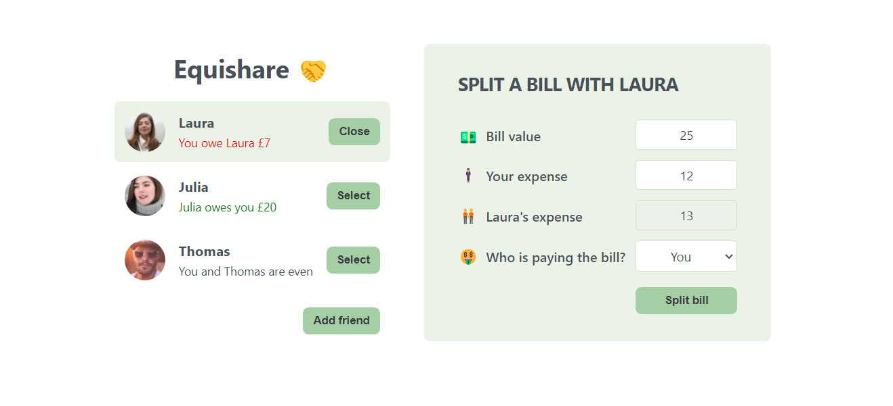

# Equishare - split the bill 

**Developer: Aleksandra Haniok**

💻 [Visit live website](https://equishare.netlify.app/)

### About

This is a React application to split bills and track shared expenses between two friends to determine each person's owed amount.

The project was build as part of this [React course](https://www.udemy.com/course/the-ultimate-react-course/) with Jonas Schmedtmann to learn React JS state management, work with components, props, forms and events.

## Project Structure

The project consists of the following components:

- `App.js`: The main component that manages the state and renders other components
- `AddFriendForm.js`: Allows users to add new friends
- `Button.js`: A reusable button component
- `Friend.js`: Renders an individual friend
- `FriendsList.js`: Renders the list of friends
- `SplitBillForm.js`: Allows users to split a bill with a selected friend

### Features

- Add a new friend to the list of friends to split a bill with
- Display of value owed or being owed with color-coding indication
- Instant calculation of the amount owed by each friend as you input bill details
- Reusabile components
- Responsive design on various screen sizes

### Technologies used

- HTML5
- CSS3
- JavaScript
- React

### Graphics

- Favicon was taken from [Flaticon](https://www.flaticon.com/)
